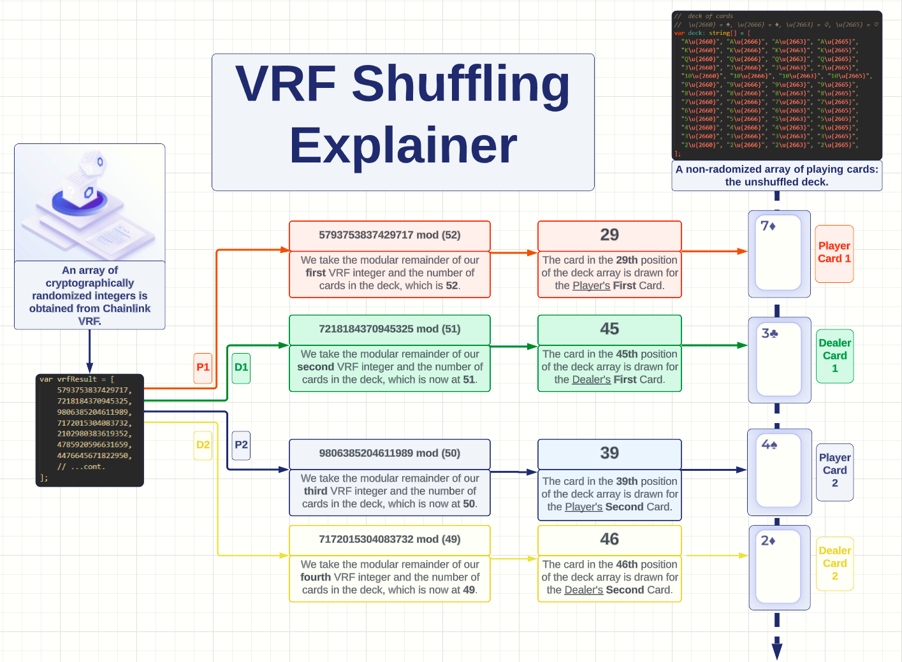

# :black_joker: Smart Contract Blackjack :diamonds: :spades: :hearts: :clubs:

> The House is a Smart Contract in this Blackjack dApp that utilizes 
> Chainlink VRF for cryptograhically-guaranteed randomized deck shuffling.

<< DEMO GIF WILL GO HERE (CENTERED) >>

## :file_folder: Table of Contents

-   [General Information](#-general-information)
-   [Technologies Used](#-technologies-used)
-   [Setup](#setup)
-   [Advantages Over TradFi Blackjack](#-advantages-over-tradfi-blackjack)
-   [Explainer: VRF-Based Shuffling Method](#-explainer-vrf-based-shuffling-method)
-   [Project Future](#-project-future)
-   [Meet the Team](#-meet-the-team)

## ℹ️ General Information

-   Start playing blackjack NOW with Smart Contract blackjack to cut out the middleman and avoid storing your money in a centralized escrow.
-   Greater shuffling randomization than traditional methods is achieved through Chainlink VRF's cryptographically guaranteed random number issuance. 
-   This project was built for and submitted to the [Spring '23 Chainlink Hackathon](https://chain.link/hackathon).

## 💻 Technologies Used

-  [![chainlink]][chainlink-url]
- [![React][react.js]][react-url]
- [![solidity]][solidity-url]
- [![web3.js]][web3.js-url]
- [![truffle]][truffle-url]
- [![ganache]][ganache-url]

## :wrench: Setup
 - Ensure the [latest recommended version](https://nodejs.org/en) of Node and npm are installed on your machine.
 - Clone this repository and run `npm install` to download all dependencies.
 - Run `npm run start` to serve the application locally (localhost:3000)
 - If the application throws a build error on `main`, try the `demo` branch to test the game and the application's UI (see 'Challenge' below for more details): 
  
#### :warning: Challenge :warning:

Currently, we are working to overcome the challenge of obtaining a VRF response prior to dealing. When building locally on `main`, the most up-to-date logic for VRF shuffling throws a build error. We have provided a `demo` branch for game testing with hardcoded values in place of the response. This is our highest-priority item, but we will wait until the judging period for the Spring '23 Hackathon is over to continue work on this.

## 📈 Advantages Over TradFi Blackjack

|  | No Escrow Required | Trustless Randomization | Instant Payouts | No Middleman | Plug & Play |
|--|--|--|--|--|--|
| DeFi | 
✅ The only 'escrow' made is for your current hand's wager. You do not need to entrust a third party with any other funds.
 | 
✅ Utilizes transparent methods of cryptographically guaranteed randomness from Chainlink VRF for card deals and draws.
| 
✅ Payouts are distributed with each hand as you play.
 | 
✅ The Smart Contract is automated and requires little overhead to remain operational.
 | 
✅ No account creation necessary. The user can begin playing instantly with a funded MetaMask account.
 |
| TradFi | 
❌ To bet, you must entrust your bankroll to an escrow account with a third party (the House).
 | 
❌ Methods of Randomization are not publicly available, requiring the user to trust the house is acting in good faith.
 | 
❌ Payouts are distributed asynchronously and may take several business days
 | 
❌ The House takes a sizable cut ('rake') from every hand and has high operational expenses.
 | 
❌ The user must create and verify an account, provide their banking information, and wire funds to begin playing.
 |

## 🤓 Explainer: VRF-Based Shuffling Method

## 🧗‍♀️ Project Future

> << A synopsis of the vision for the project moving forward >>
-  << detail challenges faced during development and the steps we anticipate taking to overcome them >>
-  << list some cool features we'd like to implement down the road >>

## 👋 Meet the Team

<< side-by-side github pfp's with embedded URLs >>
<< dev names below each pfp >>
Temporary: VRFID 2153

<!-- MARKDOWN LINKS & IMAGES -->

[react.js]: https://img.shields.io/badge/React-20232A?style=for-the-badge&logo=react&logoColor=61DAFB
[react-url]: https://reactjs.org/
[chainlink]: https://img.shields.io/badge/chainlink-375BD2?style=for-the-badge&logo=chainlink&logoColor=61DAFB
[chainlink-url]: https://chain.link/
[solidity]: https://img.shields.io/badge/Solidity-35495E?style=for-the-badge&logo=solidity&logoColor=4FC08D
[solidity-url]: https://soliditylang.org/
[truffle]: https://img.shields.io/badge/TRUFFLE-DD0031?style=for-the-badge&logo=data:image/png;base64,iVBORw0KGgoAAAANSUhEUgAAABAAAAAQCAYAAAAf8/9hAAABS2lUWHRYTUw6Y29tLmFkb2JlLnhtcAAAAAAAPD94cGFja2V0IGJlZ2luPSLvu78iIGlkPSJXNU0wTXBDZWhpSHpyZVN6TlRjemtjOWQiPz4KPHg6eG1wbWV0YSB4bWxuczp4PSJhZG9iZTpuczptZXRhLyIgeDp4bXB0az0iQWRvYmUgWE1QIENvcmUgNS42LWMxNDIgNzkuMTYwOTI0LCAyMDE3LzA3LzEzLTAxOjA2OjM5ICAgICAgICAiPgogPHJkZjpSREYgeG1sbnM6cmRmPSJodHRwOi8vd3d3LnczLm9yZy8xOTk5LzAyLzIyLXJkZi1zeW50YXgtbnMjIj4KICA8cmRmOkRlc2NyaXB0aW9uIHJkZjphYm91dD0iIi8+CiA8L3JkZjpSREY+CjwveDp4bXBtZXRhPgo8P3hwYWNrZXQgZW5kPSJyIj8+nhxg7wAAA1lJREFUOI1Vk31M1AUYxz/3Iq9CwcXBTOUIDJocguFLCcEqJWCJ5ezoBd0K1+yPdJEDt9Jp/VHGpilzgEIOojOjUi9iFTtA8AAl7BY4cqwQFAM6uEyOg9+Pe/pHGX62Z3ueP77fZ/vueTQiAoBnykNJ4S56rzrjFuv1helpac/6bUiJDjItRTzeG/329ubOU19WHThWej3rdQvziMh85Wds2p8dnyydjU3SJSIXRaSi5Repd16RttFbUu1olQv1330k6ty8Zr6pKSuvM4dGSt9PzTIkImenJ+Xsoc9k3+Z8edG0UnamZ4nVZhPbQJ90tjuaHjDocXQdTAgIkyLLdlHuba6vrJY92wqkv7dP0qLj5bknUiSZYLE12+Vce6u0XXI0iAhaINpaWbXf5/ORuCoJFfACURERtLW0Ynosho/LjxEaGoIpdTUpcY/zZMQSjtfW5LhhCyNDw0e2rHtGMmNXSmnJhyIicnR2VKZFZG9evmQnrRVVUWQhR/YUS+bGLLks0qkfGRrOnp7yYDAa6bnyKyg+VmgDqZl1cficlXfyLKSZEti64w2WxZjobu+gqcbKu2dO4cK3SqsoyjJECA5ZzM0/B/m26gtydCFc+/dvKtRxTpz/mpNlx5kcHMZ2uo67t0dptJ0nclsuN1SXTtP/e+9MUUGhX5jBgKoqjI2N8XlVOYlPrWP3RD9zwGvhCawB9IAC/IyPhv8GOegfNaCZ8Xpv7tr66qNjt0cxRkXiGh9nZmaGDw4dYENeLnaEC+4BVFXBb5Efqm8OrVbL0YdWcLGy5kdEpK7+dK2kRkbLjhfy5M2cl+Tl9RmSGZconxbtE7fz2nx43gVBdnz/g2w0r3lfIyLJwNWi7YV0NLeSYE5EAFVRGBkaJjA4iKTVKSSZzUSEh3Nn6i49vznparvEw2Fhj2ju/UI58PZ7BW/hsLcQGx+PX4A/iKDMKrgnJpj2ePD5fGg0GgKDgjAYI4p1Ot1hjYjgGv+Hv/64fiY17WmLtbKa2rIKVFVhSfRyuH+yD/IN8AqARkS4M+nGkrGJlPVrPyks2l3sdk1gb2iku70D/SI9Op1uobgU2Ht/0AMEBAayPDYGe0NjifNy91fPb87daTAa0/39/ZeqcyrALaANOAk4F7r9DzIq4ym9+fzCAAAAAElFTkSuQmCC
[truffle-url]: https://trufflesuite.com/
[web3.js]: https://img.shields.io/badge/web3.js-4A4A55?style=for-the-badge&logo=web3.js&logoColor=FF3E00
[web3.js-url]: https://web3js.readthedocs.io/en/latest/
[ganache]: https://img.shields.io/badge/GANACHE-yellow?style=for-the-badge&logo=data:image/png;base64,iVBORw0KGgoAAAANSUhEUgAAABAAAAAQCAYAAAAf8/9hAAABS2lUWHRYTUw6Y29tLmFkb2JlLnhtcAAAAAAAPD94cGFja2V0IGJlZ2luPSLvu78iIGlkPSJXNU0wTXBDZWhpSHpyZVN6TlRjemtjOWQiPz4KPHg6eG1wbWV0YSB4bWxuczp4PSJhZG9iZTpuczptZXRhLyIgeDp4bXB0az0iQWRvYmUgWE1QIENvcmUgNS42LWMxNDIgNzkuMTYwOTI0LCAyMDE3LzA3LzEzLTAxOjA2OjM5ICAgICAgICAiPgogPHJkZjpSREYgeG1sbnM6cmRmPSJodHRwOi8vd3d3LnczLm9yZy8xOTk5LzAyLzIyLXJkZi1zeW50YXgtbnMjIj4KICA8cmRmOkRlc2NyaXB0aW9uIHJkZjphYm91dD0iIi8+CiA8L3JkZjpSREY+CjwveDp4bXBtZXRhPgo8P3hwYWNrZXQgZW5kPSJyIj8+nhxg7wAAAqVJREFUOI1t08trXVUUx/Hv2ufse8+57+Q+ElPSUCWtpdqBIFQ6ysSRgkJxpDix+gc4ETrsSOysIx/gg9aBUiwiOLCIoChGoRPB0kRtoA9jYnJz3+fcs/fqIPH2ov5Ge7D2h/1YSwBWL75M6hQbCMnY0x9kzLWqzx5aOvwWaNTZ3DiXDEeXHQGhAa+KCDx29gMMgADOK8lYiaw58fBC9Nli036u7d+Pub/XlyoFc6lUCL7OhZxyXvHKJAYgdYoRKTerwYXDLftLvRI+lwy6jDOPRxgnKXkbrFSL5odSbN42IvPuQDEAxcicOdKUtUZZXvcKw9SDBIjI/vlEcF5RFQo5ebVW8GtxzrwyAeZmo0+janMucSHZqI+oHlzsn+yvXTog85ArN0rlUvzuBKjFbpQmCUG5Rb65DCh+1DnYK/iki2YJ+foRbO0QLnP4cTKYAKs3k1Ej34PePQKjlBdPEi08jk/6uMEu+dYx4sUnILBke/fIetsgpBPg/Mdb+uX1lPmFHLa7Du116vUKheUVSo8+jcR1dG+DyvAm1mSE+YiZUgBACFApGD661uav3YytjufO1h+8cOo2T50+SXsQILs3ULH89KflkXlDtWh4/6v2A6BaNCRj5ZNvO4SB0Bt6dvrK0aVbzM8YaM1w8eoOH17b5cWVGk8ejbjyXecB4DxRGAgPzYYA1CsG75Uf1z23txN2uj2u/zZiYdZyazMlb4VaKbATAIin/gwjgrXwxWqXO9sZqkqjGuKckreCVyUwUpw8IvA8cHcayRzs9T2NSkCrFmIEbChstjN+XhsO4py8Ng1cBZaBNyetIxDnBJnqp/2Z4b10rMsivDMNAAyAN4DjwBX+m28UThvhbBjIXT0YKPM/hTeAM8AzwK/ABvASsAJ8/+/i+whWCI78GsrmAAAAAElFTkSuQmCC
[ganache-url]: https://trufflesuite.com/ganache/
